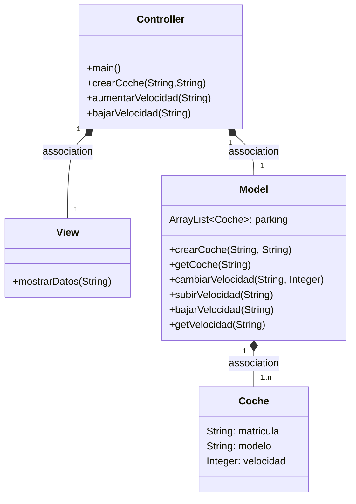
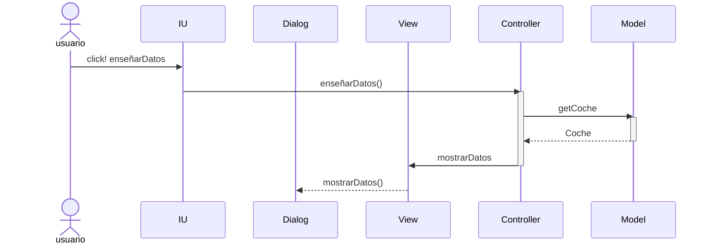

# Arquitectura MVC

---
## Cambios que he hecho:
-Cambiamos el método de mostrar velocidad en el view
por un método que gracias al getCoche de Modelo muestre todos
los datos de este.
-En el controller hacemos un método para mostrar los datos que lo único que 
hace es llamar al método de View.
-En la IU añadimos un text field para meter la matrícula del coche  y un 
botón que a partir de esta llame al método de controller de mostrar los datos.

---
## Diagrama de clases:

---

## Diagrama de Secuencia

