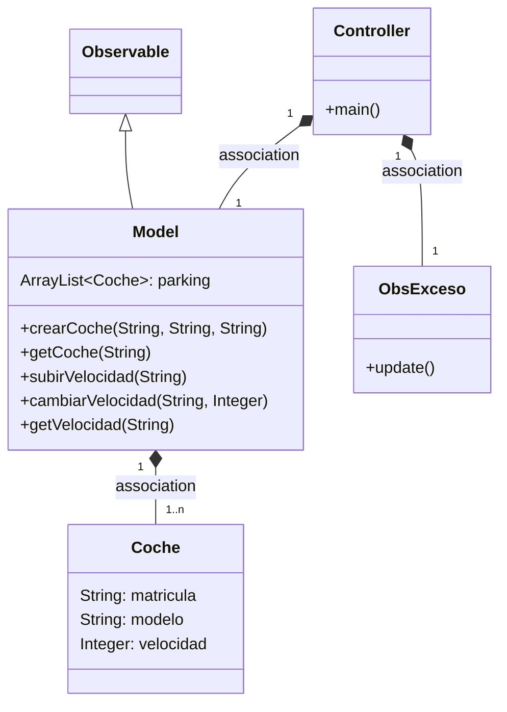
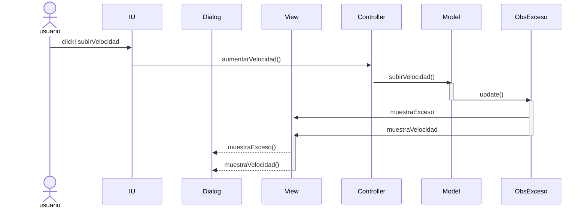

# Arquitectura MVC con Observer

## Cambios que he hecho:
-Añadimos un nuevo método en la View que muestre un mensaje en el Dialog
si nuestro coche se ha excedido de 120 km/hr.
-Cambiamos la clase OVelocidad del Observer por una clase ObsExceso
que hace lo mismo pero también llama al método nuevo de la View
por si nos sobrepasamos de velocidad.
-Cambiamos en el Controller el Observer que añade.

---
## Diagrama de clases:



---

## Diagrama de Secuencia


```mermaid
sequenceDiagram
participant View
participant Controller
participant ObserverVelocidad
end
participant Model

    Controller->>Model: cambiarVelocidad()
    activate Model
    Model->>ObserverVelocidad: update()
    deactivate Model
    activate ObserverVelocidad
    ObserverVelocidad->>+View: muestraVelocidad
    deactivate ObserverVelocidad
    activate View
    View->>View: sout
    deactivate View
```